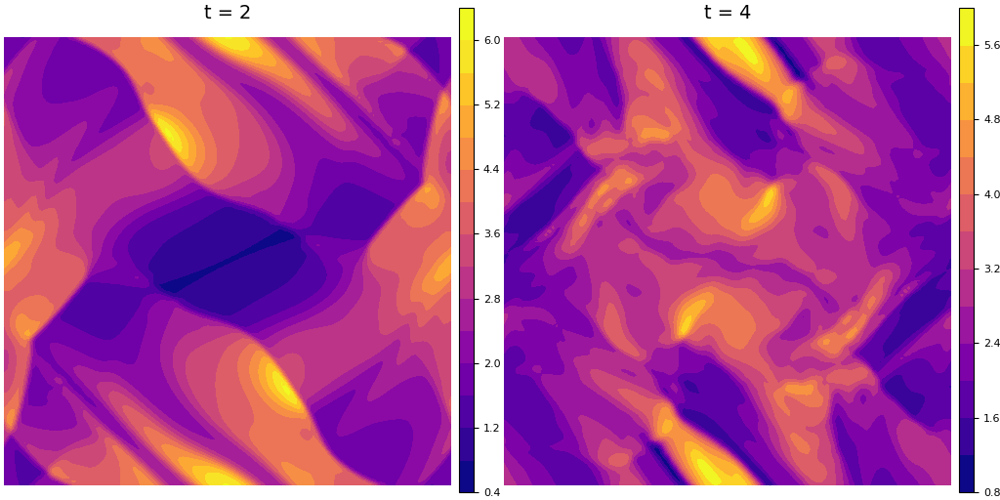

## Overview

This repository seeks to make use of the weighted essentially non-oscillatory (WENO) finite-difference schemes1,2 to solve nonlinear hyperbolic PDEs. Our short-term goals are to generalize the AdaWENO scheme3 to other systems, as well as solve systems with source terms4.

We use the 3rd order TVD Runge-Kutta method for the temporal discretization and the 5th order WENO scheme for the spatial discretization5. The nonlinear weights are calculated using smoothness indicators defined by Yamaleev and Carpenter6, which improves upon the accuracy of the scheme at shocks and discontinuous points as compared with those weights defined in Jiang and Shu2.

We have written solvers for Burgers' equation, Euler equations, and ideal MHD equations7 in 1D and 2D. The following extensions are proposed: Euler with source terms (e.g. for Rayleigh-Taylor instabilities), shallow water equations8, Hall MHD9, curvilinear coordinates10.

## Orszag-Tang vortex

  

Above are contour plots of the mass density at the snapshots t=2 and t=4 on a 128x128 grid.

## References
1. X. D. Liu, S. Osher, and T. Chan, *J. Comput. Phys.* **115**:200-212 (1994).
2. G. S. Jiang and C. W. Shu, *J. Comput. Phys.* **126**(1):202-228 (1996).
3. J. Peng et al., *Comput. Fluids* **179**:34-51 (2019).
4. Y. Xing and C. W. Shu, *J. Sci. Comput.* **27**(1-3):477-494 (2005).
5. C. W. Shu, "Essentially non-oscillatory and weighted essentially non-oscillatory schemes for hyperbolic conservation laws," in *Advanced Numerical Approximation of Nonlinear Hyperbolic Equations*, Springer Lecture Notes in Mathematics **1697** (Springer, New York, 1998).
6. N. K. Yamaleev and M. H. Carpenter, *J. Comput. Phys.* **228**(11):4248-4272 (2009).
7. A. J. Christlieb, J. A. Rossmanith, and Q. Tang, *J. Comput Phys.* **268**:302-325 (2014).
8. Y. Xing and C. W. Shu, *J. Comput. Phys.* **208**:206-227 (2005).
9. J. Huba, "Numerical Methods: Ideal and Hall MHD", *Proceedings of ISSS* **7**:26-31 (2005).
10. A. J. Christlieb et al., *SIAM J. Sci. Comput.* **40**(4):A2631-A2666 (2017).
