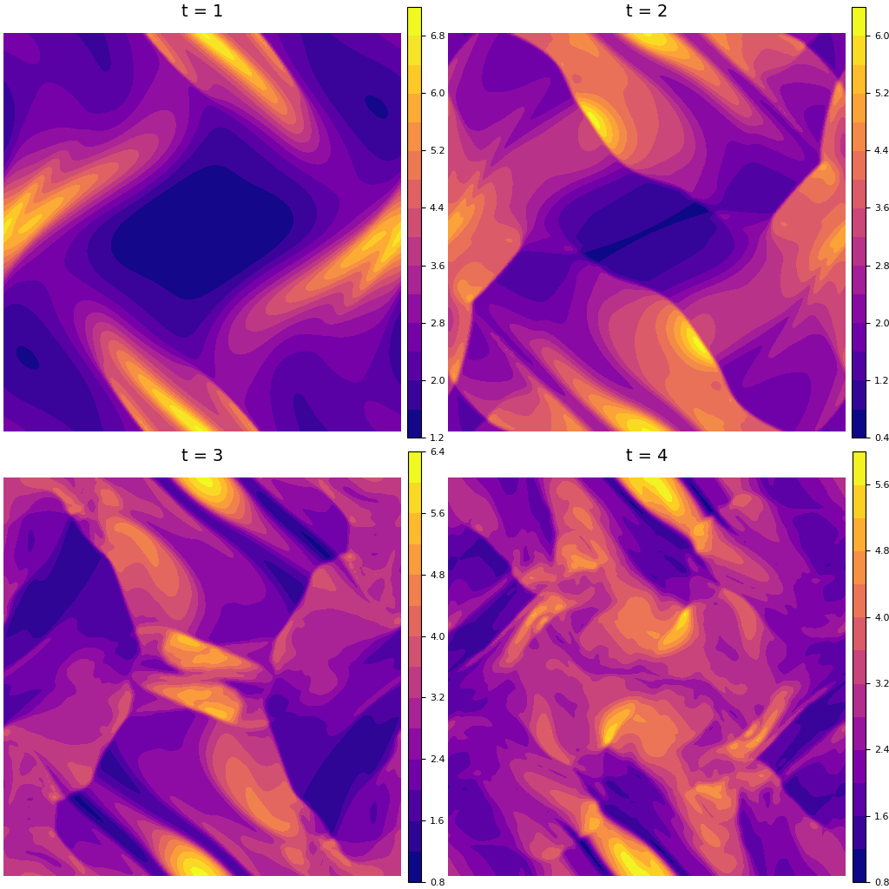

## Overview

Magnetohydrodynamics (MHD) is the field of physics which describes the dynamics of fluids under the influence of magnetic fields. MHD can be used to describe astrophysical processes and is a good starting point for modeling plasma instabilities. The simplest form of MHD is called ideal MHD, which is able to capture physics on macro length and time scales.

The ideal MHD equations are a set of eight nonlinear partial differential equations. They are a combination of the Navier-Stokes equations from fluid dynamics and Maxwell's equations from electromagnetism. Even though it is the simplest MHD system, ideal MHD is still more complicated than the Navier-Stokes equations for a multitude of reasons, chief among them being the inclusion of the magnetic field resulting in three characteristic wave modes (and corresponding wave speeds) of the system, compared to just one (sound waves) for Navier-Stokes, as well as maintaining the divergence-free condition of the magnetic field in the numerical simulation. If not treated properly, simulations can eventually become unphysical and can lead to numerical instabilities, as has repeatedly been shown in the literature.

Our main result in this repository is the simulation of the ideal MHD equations1 in 2D in the Julia programming language. Along the way, we implemented solvers for Burgers' equation and the Euler equations of fluid dynamics, the latter being the viscous-free version of Navier-Stokes.

### Details

We use the 3rd order TVD Runge-Kutta method for the temporal discretization and the 5th order WENO finite-difference scheme2,3,4 for the spatial discretization. The nonlinear weights are calculated using smoothness indicators defined by Yamaleev and Carpenter5, which improves upon the accuracy of the scheme at shocks and discontinuous points as compared with those weights defined in Jiang and Shu3. 

Our short-term goals are to generalize the AdaWENO scheme6 to other systems, as well as solve systems with source terms7. The following extensions are proposed: shallow water equations8, Hall MHD9, curvilinear coordinates10.

## Orszag-Tang vortex

Below are contour plots of the mass density on a 192x192 grid for the Orszag-Tang vortex problem, which is a standard test for ideal MHD codes to gauge a numerical scheme's ability to capture shocks and shock-shock interactions. The contours as displayed above qualitatively agree with others in the literature1,11.

  

## References
1. A. J. Christlieb, J. A. Rossmanith, and Q. Tang, *J. Comput Phys.* **268**:302-325 (2014).
2. X. D. Liu, S. Osher, and T. Chan, *J. Comput. Phys.* **115**:200-212 (1994).
3. G. S. Jiang and C. W. Shu, *J. Comput. Phys.* **126**(1):202-228 (1996).
4. C. W. Shu, "Essentially non-oscillatory and weighted essentially non-oscillatory schemes for hyperbolic conservation laws," in *Advanced Numerical Approximation of Nonlinear Hyperbolic Equations*, Springer Lecture Notes in Mathematics **1697** (Springer, New York, 1998).
5. N. K. Yamaleev and M. H. Carpenter, *J. Comput. Phys.* **228**(11):4248-4272 (2009).
6. J. Peng et al., *Comput. Fluids* **179**:34-51 (2019).
7. Y. Xing and C. W. Shu, *J. Sci. Comput.* **27**(1-3):477-494 (2005).
8. Y. Xing and C. W. Shu, *J. Comput. Phys.* **208**:206-227 (2005).
9. J. Huba, "Numerical Methods: Ideal and Hall MHD", *Proceedings of ISSS* **7**:26-31 (2005).
10. A. J. Christlieb et al., *SIAM J. Sci. Comput.* **40**(4):A2631-A2666 (2017).
11. A. J. Christlieb et al., *J. Comput. Phys.* **316**:218-242 (2016).
